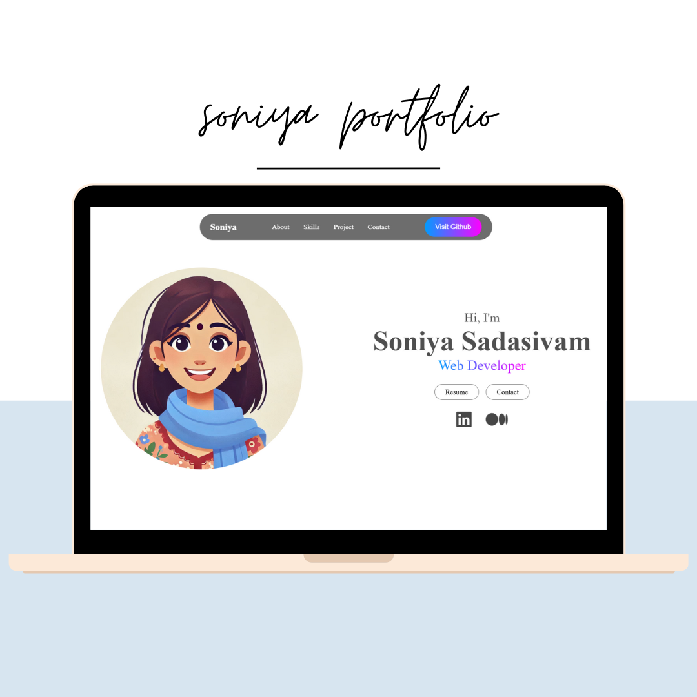

# 🌟 Soniya's Developer Portfolio 🌟

Welcome to my personal portfolio! 🚀 Dive into my world of web development and explore my projects, skills, and achievements.

---

## 🖥️ **About Me**

Hi there! I'm **Soniya**, a passionate **Web Developer** who loves crafting interactive and responsive web experiences. Whether it's designing sleek user interfaces or tackling backend challenges, I thrive on solving problems and bringing ideas to life.

---

## 📂 **Portfolio Features**

- 🎨 **About Section**: Get to know me and my passion for web development.  
- 🛠️ **Skills Highlight**: A showcase of my technical expertise in both frontend and backend development.  
- 📚 **Projects**: Explore my latest projects with live demos and GitHub repositories.  
- 📬 **Contact Me**: Easy ways to connect through email and LinkedIn.

---

## 🛠️ **Technologies Used**

This portfolio is built with modern technologies to ensure performance and responsiveness:

- **HTML5 & CSS3**: Structuring and styling the portfolio.  
- **JavaScript**: For interactivity and functionality.  
- **Font Awesome**: Adding sleek icons for better user experience.  
- **Responsive Design**: Ensuring compatibility across devices.  

---

## 📝 **How to Use**

1. Clone this repository:
   ```bash
   git clone https://github.com/SoniyaShivam/portfolio.git
   ```
2. Navigate to the project directory:
   ```bash
   cd portfolio
   ```
3. Open `index.html` in your favorite browser to view the portfolio.

---

## 📬 **Get in Touch**

Want to collaborate or just say hi? Here's how you can reach me:

- 📧 Email: [soniyasshivam10@gmail.com](mailto:soniyasshivam10@gmail.com)  
- 💼 LinkedIn: [Soniya Sadasivam](https://www.linkedin.com/in/soniya-sadasivam/)  

---

## 🎨 **Screenshots**

  


---

### 🌟 **Thank You for Visiting!**

Feel free to explore, fork, and contribute to this portfolio project. Your feedback and suggestions are always welcome. Let’s build something amazing together! 🌟

